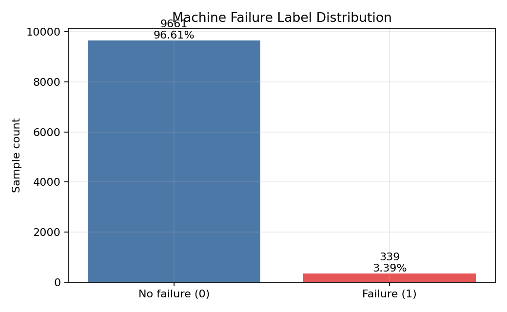
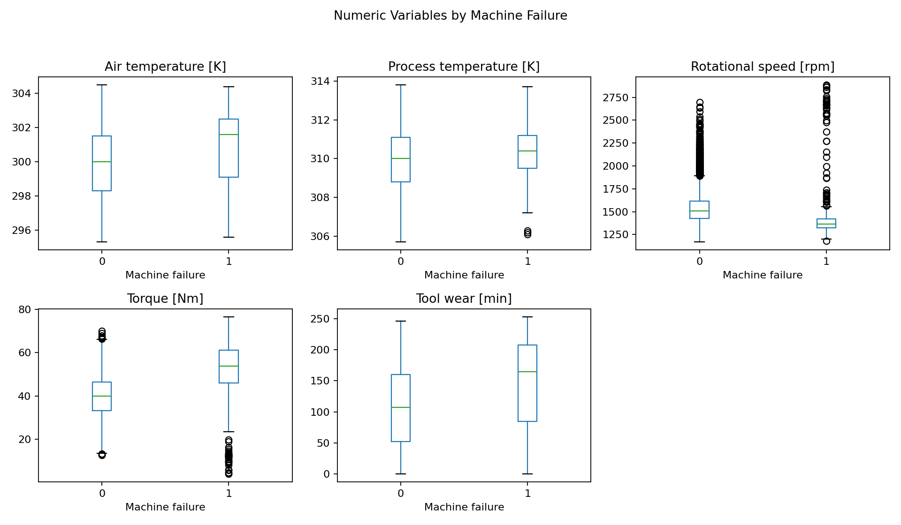
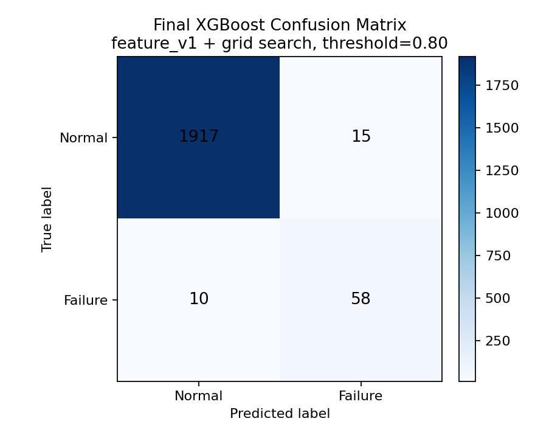
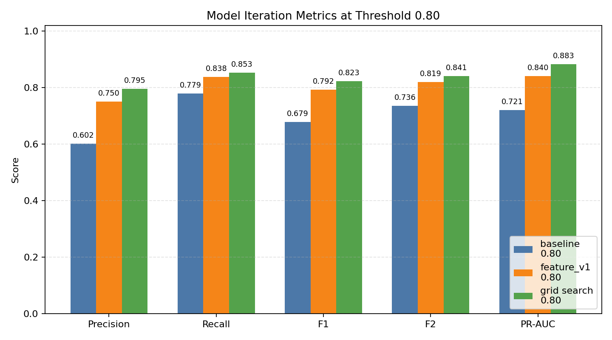

# 基于 AI4I 2020 的制造设备故障分析与预测性维护项目

这是一个面向制造业/工业数据分析方向的练手项目。项目目标是把一份工业设备运行数据从业务理解、数据检查、SQL 分析一路做到 baseline 建模、阈值调优、轻量特征工程、参数搜索和错误样本分析，形成一个可以展示、可以讲清楚、也能作为后续更难项目先手练习的完整闭环。

## 项目背景

在制造业场景中，设备故障通常是低频但高成本事件。一旦设备发生故障，可能带来停机、维修成本、产能损失和质量风险。预测性维护的价值在于：在故障真正发生前，从设备运行状态中识别风险信号，为维护排程和风险预警提供参考。

本项目基于 AI4I 2020 数据集，围绕设备是否发生故障进行分析，并建立故障预测 baseline 与后续轻量优化版本。项目更关注完整分析流程、指标口径和业务解释，而不是复杂工程化或单纯追求模型分数。

## 数据说明

数据文件位于 `data/raw/ai4i2020.csv`，共有 10000 条记录、14 个字段。每一行可以理解为一条设备运行记录。

主要字段包括：

- `Type`：产品类型，分为 `L`、`M`、`H`。
- `Air temperature [K]`：环境空气温度。
- `Process temperature [K]`：工艺过程温度。
- `Rotational speed [rpm]`：设备转速。
- `Torque [Nm]`：设备运行扭矩。
- `Tool wear [min]`：刀具磨损时间。
- `Machine failure`：总故障标签，`1` 表示发生故障，`0` 表示未发生故障。
- `TWF/HDF/PWF/OSF/RNF`：具体故障原因标记，用于辅助解释，不直接作为当前 baseline 的预测特征。

基础数据质量检查显示：缺失值总数为 0，完全重复行数量为 0。总故障样本为 339 条，整体故障率约为 3.39%，属于明显类别不平衡问题。

## 项目目标

本项目主要完成以下目标：

1. 说明 AI4I 2020 在预测性维护场景中的业务含义。
2. 使用 pandas 完成基础数据理解、数据质量检查和第一轮 EDA。
3. 将数据导入 MySQL，并用 SQL 固化关键业务分析口径。
4. 基于核心运行状态字段建立第一版 baseline 模型。
5. 通过阈值调优、少量业务特征和 XGBoost 网格搜索，验证模型是否能稳定提升。
6. 输出关键图表、分析结论、错误样本分析和后续迭代方向。

## 项目流程

当前项目按 Day1-Day10 的节奏推进：

- Day1：业务理解与字段说明。
- Day2：数据质量检查，包括缺失值、重复值、标签分布和字段分布。
- Day3：第一轮 EDA，观察产品类型、刀具磨损、扭矩、转速等变量与故障的关系。
- Day4：MySQL 导入流程和 SQL 资产整理。
- Day5：SQL 业务分析收尾，沉淀固定口径查询。
- Day6：baseline 建模，比较 Logistic Regression 和 XGBoost。
- Day7：整理 README、summary、关键图表和最小依赖，形成第一版展示项目。
- Day8：XGBoost 阈值调优与 PR 曲线分析，确认默认 `0.5` 阈值并非唯一合理选择。
- Day9：加入少量业务特征 `feature_v1`，验证特征工程是否提升 precision、recall、F1、F2 和 PR-AUC。
- Day10：基于 `feature_v1` 做 GridSearchCV 调参，并分析最终模型的 FP / FN 错误样本。

## SQL 分析发现

SQL 分析脚本位于 `sql/` 目录，核心文件是 `sql/03_basic_analysis.sql`。当前 SQL 分析已经覆盖 MVP 所需的主要问题，不再继续扩展查询数量。

关键发现包括：

- 整体故障率约为 3.39%，故障样本明显少于正常样本。
- 按产品类型看，`L`、`M`、`H` 的故障率约为 3.92%、2.77%、2.09%。由于各类型样本量不同，比较内部故障率比比较故障数量更合理。
- 刀具磨损是比较明显的业务信号。`Tool_wear` 在 201-300 分钟高磨损组的故障率约为 15.49%，明显高于低磨损区间。
- 故障组相比正常组，平均扭矩更高、平均转速更低、平均刀具磨损更高。
- `TWF/HDF/PWF/OSF/RNF` 与总故障标签并不是完全一一对应，因此当前主线仍以 `Machine failure` 作为总故障目标。

这些结论属于相关性观察，不能直接解释为因果关系。但它们为后续 baseline 特征选择提供了业务依据。

## 关键图表

项目图表整理在 `reports/figures/`：











## 模型结果

建模 notebook 位于 `notebooks/03_model_baseline.ipynb`。

当前建模目标是预测 `Machine failure`。第一版 baseline 只使用前期 EDA 和 SQL 分析中已经具有业务意义的基础变量：

- `Type`
- `Air temperature [K]`
- `Process temperature [K]`
- `Rotational speed [rpm]`
- `Torque [Nm]`
- `Tool wear [min]`

当前没有使用 `UDI` 和 `Product ID`，因为它们更像编号字段；也没有使用 `TWF/HDF/PWF/OSF/RNF`，因为这些字段更像故障原因标签，直接用于预测总故障可能造成标签泄漏。

测试集共有 2000 条记录，其中故障样本 68 条。第一版 baseline 的故障类表现如下：

| 模型 | 故障类 Precision | 故障类 Recall | 故障类 F1-score | 说明 |
| --- | ---: | ---: | ---: | --- |
| Logistic Regression | 0.142 | 0.824 | 0.242 | 能找回较多故障样本，但误报较多 |
| XGBoost | 0.293 | 0.882 | 0.440 | 故障召回率更高，整体更适合作为当前 baseline 主结果 |

由于故障样本占比很低，accuracy 不是最重要指标。后续优化统一关注故障类 precision、recall、F1、F2、Average Precision / PR-AUC 和混淆矩阵。

后续模型迭代结果如下，均以测试集和主参考阈值 `0.80` 为口径：

| 版本 | Precision | Recall | F1 | F2 | PR-AUC | TP | FP | TN | FN | 说明 |
| --- | ---: | ---: | ---: | ---: | ---: | ---: | ---: | ---: | ---: | --- |
| XGBoost baseline | 0.602 | 0.779 | 0.679 | 0.736 | 0.721 | 53 | 35 | 1897 | 15 | 阈值调优后，precision 明显好于默认 0.5 |
| feature_v1 default | 0.750 | 0.838 | 0.792 | 0.819 | 0.840 | 57 | 19 | 1913 | 11 | 少量业务特征带来明显提升 |
| feature_v1 grid search best | 0.795 | 0.853 | 0.823 | 0.841 | 0.883 | 58 | 15 | 1917 | 10 | 当前最终推荐版本 |

最终推荐版本为 `feature_v1_grid_search_best + threshold 0.80`。该版本相比原始 XGBoost baseline 同时提升 precision、recall、F1、F2 和 PR-AUC，并把 FP 从 `35` 降到 `15`，FN 从 `15` 降到 `10`。

## 业务建议

基于当前分析，可以给出以下业务级结论：

- 在设备维护分析中，优先关注高刀具磨损样本，尤其是 `Tool_wear` 超过 200 分钟的运行记录。
- 同时关注高扭矩、低转速和高 `torque_speed_ratio` 的组合，因为最终模型主要捕捉到的是这类高负载故障模式。
- 对不同产品类型比较风险时，应使用故障率而不是故障数量，避免被样本量差异误导。
- 最终模型在 `threshold=0.80` 下更适合作为主分析阈值；如果业务更怕漏报，可以把 `threshold=0.50` 作为召回优先的筛查候选。
- 误报样本中高磨损比例达到 80%，很多并不是完全随机误报，而是“高风险但尚未发生故障”的边界状态。
- 漏报样本主要是高磨损但扭矩不高、转速不低的低信号故障，后续如果继续优化，应优先围绕这类样本改进。

## 局限与下一步

当前项目已经形成练手闭环，但仍有明显局限：

- AI4I 2020 是模拟工业数据，不能完全代表真实工厂生产环境。
- 当前特征工程保持轻量，只加入了少量业务特征，没有做复杂特征扩展。
- 当前模型虽然已经明显优于 baseline，但仍会漏掉“高磨损但负载信号不强”的故障样本。
- 具体故障原因字段 `TWF/HDF/PWF/OSF/RNF` 只用于辅助解释，不进入训练特征，避免标签泄漏。
- 当前项目以 notebook 分析为主，`src/` 和 `data/processed/` 作为后续工程化预留，本轮收尾不做大规模拆分。

如果后续继续迭代，可以考虑：

- 围绕漏报样本补充更细的刀具磨损区间或磨损与产品类型的轻量交互。
- 对不同阈值做维护成本视角的业务模拟，而不是只看模型指标。
- 将 notebook 中稳定的特征构造、训练和评估逻辑逐步沉淀到 `src/`。
- 使用更真实的工业数据集继续练习，例如 SECOM、Scania APS 或 Hydraulic Systems。
- 整理更适合简历和面试表达的项目描述。

## 项目结构

```text
ai4i_predictive_maintenance/
├── data/
│   ├── raw/ai4i2020.csv
│   └── processed/              # 预留目录，当前特征在 notebook 中即时生成
├── notebooks/
│   ├── 01_data_understanding.ipynb
│   ├── 02_sql_analysis_support.ipynb  # 预留文件，SQL 主体沉淀在 sql/ 目录
│   └── 03_model_baseline.ipynb
├── reports/
│   ├── figures/
│   └── summary.md
├── sql/
│   ├── 01_create_database_and_table.sql
│   ├── 02_check_import.sql
│   ├── 03_basic_analysis.sql
│   └── 04_views.sql
├── src/                        # 后续工程化预留，当前项目以 notebook 为主
├── README.md
└── requirements.txt
```

## 如何运行

1. 安装依赖：

```bash
pip install -r requirements.txt
```

2. 在项目根目录运行 notebook：

```text
C:\2020 AI4I\ai4i_predictive_maintenance
```

3. 推荐阅读顺序：

- `notebooks/01_data_understanding.ipynb`
- `sql/02_check_import.sql`
- `sql/03_basic_analysis.sql`
- `sql/04_views.sql`
- `notebooks/03_model_baseline.ipynb`
- `reports/summary.md`

4. 如果需要复查 MySQL 分析，请先确认本地 MySQL 中存在：

```text
predictive_maintenance2020.ai4i2020
```
