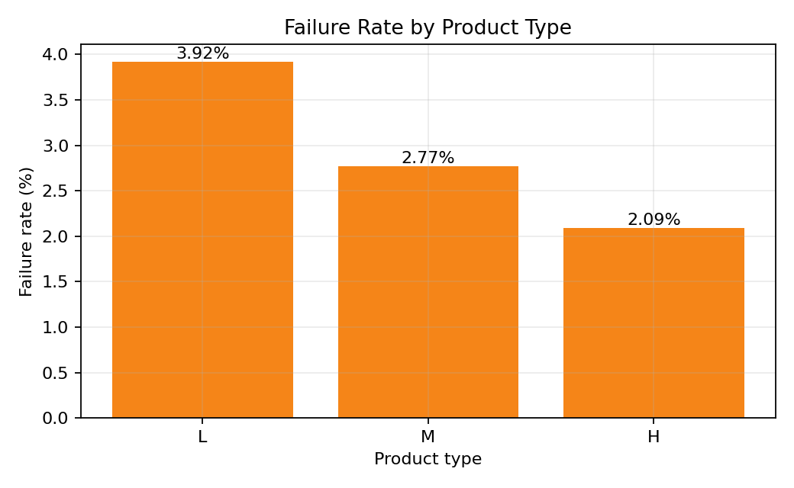
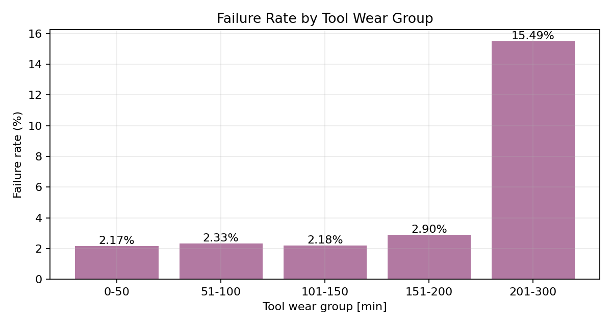
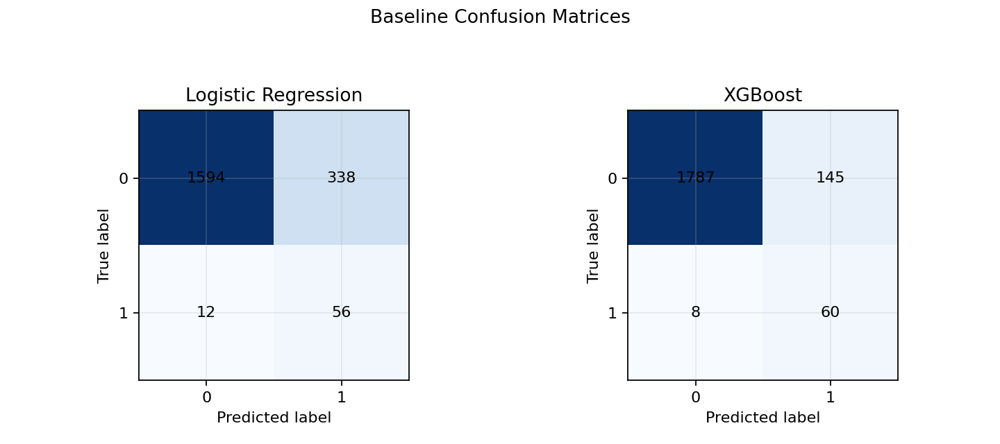

# 基于 AI4I 2020 的制造设备故障分析与预测性维护项目

这是一个面向制造业/工业数据分析方向的练手项目。项目目标不是刷 Kaggle 分数，而是把一份工业设备运行数据从业务理解、数据检查、SQL 分析一路做到 baseline 建模和结果表达，形成第一版可以展示、可以讲清楚、也可以继续迭代的 MVP。

## 项目背景

在制造业场景中，设备故障通常是低频但高成本事件。一旦设备发生故障，可能带来停机、维修成本、产能损失和质量风险。预测性维护的价值在于：在故障真正发生前，从设备运行状态中识别风险信号，为维护排程和风险预警提供参考。

本项目基于 AI4I 2020 数据集，围绕设备是否发生故障进行分析，并建立第一版故障预测 baseline。项目更关注完整分析流程和业务解释，而不是复杂调参或单纯追求模型分数。

## 数据说明

数据文件位于 `data/raw/ai4i2020.csv`，共有 10000 条记录、14 个字段。每一行可以理解为一条设备运行记录。

主要字段包括：

- `Type`：产品类型，分为 `L`、`M`、`H`。
- `Air temperature [K]`：环境空气温度。
- `Process temperature [K]`：工艺过程温度。
- `Rotational speed [rpm]`：设备转速。
- `Torque [Nm]`：设备运行扭矩。
- `Tool wear [min]`：刀具磨损时间。
- `Machine failure`：总故障标签，`1` 表示发生故障，`0` 表示未发生故障。
- `TWF/HDF/PWF/OSF/RNF`：具体故障原因标记，用于辅助解释，不直接作为当前 baseline 的预测特征。

基础数据质量检查显示：缺失值总数为 0，完全重复行数量为 0。总故障样本为 339 条，整体故障率约为 3.39%，属于明显类别不平衡问题。

## 项目目标

本项目第一版 MVP 主要完成以下目标：

1. 说明 AI4I 2020 在预测性维护场景中的业务含义。
2. 使用 pandas 完成基础数据理解、数据质量检查和第一轮 EDA。
3. 将数据导入 MySQL，并用 SQL 固化关键业务分析口径。
4. 基于核心运行状态字段建立第一版 baseline 模型。
5. 输出关键图表、分析结论和后续迭代方向。

## 项目流程

当前项目按 Day1-Day7 的节奏推进：

- Day1：业务理解与字段说明。
- Day2：数据质量检查，包括缺失值、重复值、标签分布和字段分布。
- Day3：第一轮 EDA，观察产品类型、刀具磨损、扭矩、转速等变量与故障的关系。
- Day4：MySQL 导入流程和 SQL 资产整理。
- Day5：SQL 业务分析收尾，沉淀固定口径查询。
- Day6：baseline 建模，比较 Logistic Regression 和 XGBoost。
- Day7：整理 README、summary、关键图表和最小依赖，形成第一版展示项目。

## SQL 分析发现

SQL 分析脚本位于 `sql/` 目录，核心文件是 `sql/03_basic_analysis.sql`。当前 SQL 分析已经覆盖 MVP 所需的主要问题，不再继续扩展查询数量。

关键发现包括：

- 整体故障率约为 3.39%，故障样本明显少于正常样本。
- 按产品类型看，`L`、`M`、`H` 的故障率约为 3.92%、2.77%、2.09%。由于各类型样本量不同，比较内部故障率比比较故障数量更合理。
- 刀具磨损是比较明显的业务信号。`Tool_wear` 在 201-300 分钟高磨损组的故障率约为 15.49%，明显高于低磨损区间。
- 故障组相比正常组，平均扭矩更高、平均转速更低、平均刀具磨损更高。
- `TWF/HDF/PWF/OSF/RNF` 与总故障标签并不是完全一一对应，因此当前主线仍以 `Machine failure` 作为总故障目标。

这些结论属于相关性观察，不能直接解释为因果关系。但它们为后续 baseline 特征选择提供了业务依据。

## 关键图表

项目图表整理在 `reports/figures/`：









## Baseline 模型结果

baseline notebook 位于 `notebooks/03_model_baseline.ipynb`。

当前建模目标是预测 `Machine failure`。特征选择保持克制，只使用前期 EDA 和 SQL 分析中已经具有业务意义的基础变量：

- `Type`
- `Air temperature [K]`
- `Process temperature [K]`
- `Rotational speed [rpm]`
- `Torque [Nm]`
- `Tool wear [min]`

当前没有使用 `UDI` 和 `Product ID`，因为它们更像编号字段；也没有使用 `TWF/HDF/PWF/OSF/RNF`，因为这些字段更像故障原因标签，直接用于预测总故障可能造成标签泄漏。

测试集共有 2000 条记录，其中故障样本 68 条。当前两个 baseline 的故障类表现如下：

| 模型 | 故障类 Precision | 故障类 Recall | 故障类 F1-score | 说明 |
|---|---:|---:|---:|---|
| Logistic Regression | 0.142 | 0.824 | 0.242 | 能找回较多故障样本，但误报较多 |
| XGBoost | 0.293 | 0.882 | 0.440 | 故障召回率更高，整体更适合作为当前 baseline 主结果 |

由于故障样本占比很低，accuracy 不是最重要指标。对预测性维护场景来说，故障类 recall 和 F1-score 更能反映模型是否具备初步预警价值。

## 业务建议

基于当前分析，可以给出以下初步建议：

- 在设备维护分析中，优先关注高刀具磨损样本，尤其是 `Tool_wear` 超过 200 分钟的运行记录。
- 同时关注高扭矩、低转速和高磨损组合，因为故障组在这些变量上表现出明显差异。
- 对不同产品类型比较风险时，应使用故障率而不是故障数量，避免被样本量差异误导。
- 当前 baseline 更适合作为风险筛查参考，而不是直接作为生产级故障判定系统。

## 局限与下一步

当前项目是第一版 MVP，仍有明显局限：

- AI4I 2020 是模拟工业数据，不能完全代表真实工厂生产环境。
- 当前只做了基础 baseline，没有进行系统调参和复杂特征工程。
- 当前模型 precision 仍然不高，说明误报较多，实际业务中需要结合维护成本和停机风险进一步设置阈值。
- 具体故障原因字段样本较少，不适合在第一版中过度解释。

后续可以继续迭代：

- 增加少量业务特征，例如温差、功率近似值、高磨损标记。
- 对 XGBoost 做轻量调参或阈值调整，观察故障类 F1 是否提升。
- 使用更真实的工业数据集继续练习，例如 SECOM、Scania APS 或 Hydraulic Systems。
- 整理更适合简历和面试表达的项目描述。

## 项目结构

```text
ai4i_predictive_maintenance/
├── data/
│   ├── raw/ai4i2020.csv
│   └── processed/
├── notebooks/
│   ├── 01_data_understanding.ipynb
│   ├── 02_sql_analysis_support.ipynb
│   └── 03_model_baseline.ipynb
├── reports/
│   ├── figures/
│   └── summary.md
├── sql/
│   ├── 01_create_database_and_table.sql
│   ├── 02_check_import.sql
│   ├── 03_basic_analysis.sql
│   └── 04_views.sql
├── src/
├── README.md
└── requirements.txt
```

## 如何运行

1. 安装依赖：

```bash
pip install -r requirements.txt
```

2. 在项目根目录运行 notebook：

```text
C:\2020 AI4I\ai4i_predictive_maintenance
```

3. 推荐阅读顺序：

- `notebooks/01_data_understanding.ipynb`
- `sql/02_check_import.sql`
- `sql/03_basic_analysis.sql`
- `notebooks/03_model_baseline.ipynb`
- `reports/summary.md`

4. 如果需要复查 MySQL 分析，请先确认本地 MySQL 中存在：

```text
predictive_maintenance2020.ai4i2020
```
